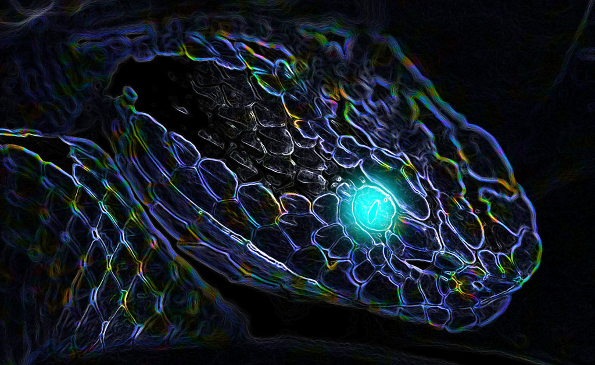

# SnakeAI
At IIT-Bombay we have an event called Summer of Code (SoC) were a group of students do a project under the guidance of mentors\
This is my persoal repository for that project

We are using Reinforcement Learning to master the popular game Snake

-----------

## classes.py
This file has information regarding the snake and food\
This file is used for
1. Drawing food and snake
2. Moving snake
3. Adding blocks to the snake
4. Checking if the snake is dead

-----------

## colors.py 
This file was used before graphcis were added to store color rgb values

-----------

## main.py
The main execution of different functions including the game loop takes place here\
This file is used to 
1. Update the game at regular intervals
2. Check collision between food and snake
3. It has the game loop

----------

This is a [link](https://www.notion.so/SOC-Snake-AI-Project-471ff57983a24f749ca0ec08df8c9472) to the resources web page\
Below is a video I made of me palying the snake game 

